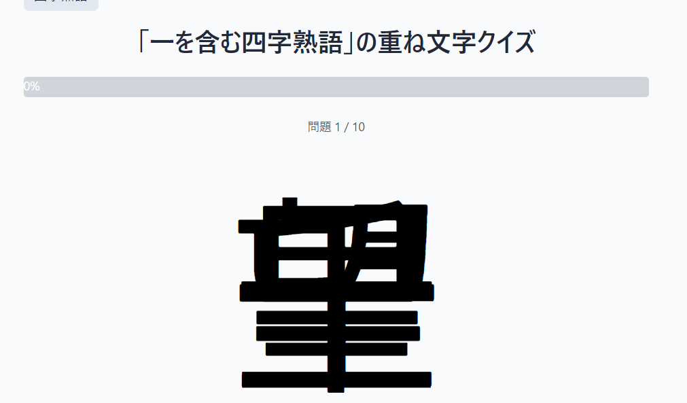

# stackglyph  - 重ね文字クイズゲーム

**Stackglyph** は、日本語の“重ね文字”をテーマにした直感勝負のクイズゲームです。  
見慣れた文字なのに読めない。そんなひっかけに挑戦してみませんか？

🌐 https://www.stackglyph.com/

---

## 🎮 遊び方

1. テーマを選択（例：四字熟語、宇宙、星座、食べ物など）
2. 表示される「重ね文字」を見て答えを推測
3. わからない場合はヒント（フラッシュカード）で助けを！
4. 回答結果や正解率、ヒント使用率なども記録

## ✨ 主な特徴

- 🔤 豊富なカテゴリで飽きずにプレイ
- 📊 正解率やヒント使用率を自動で記録
- 🏆 正解率ランキング・ミス率ソート機能
- 🔁 匿名で繰り返しプレイOK（ユーザー登録なし）

## 🔧 技術スタック

